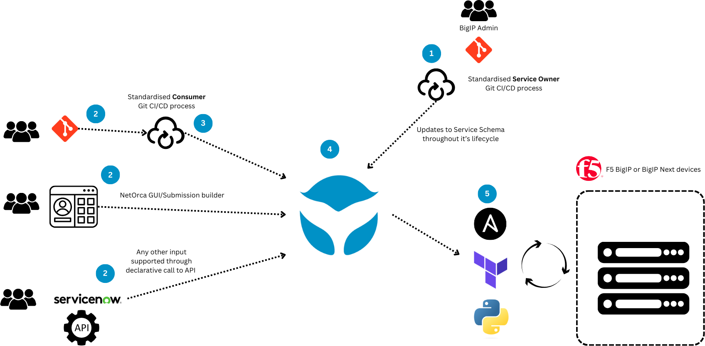
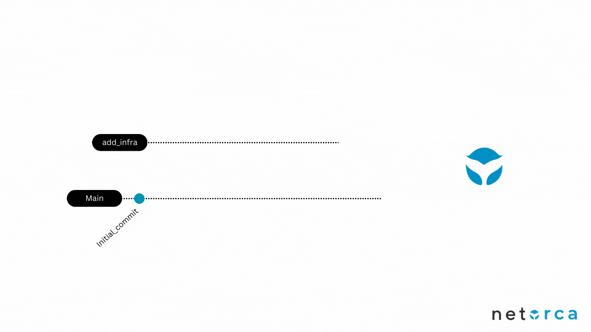
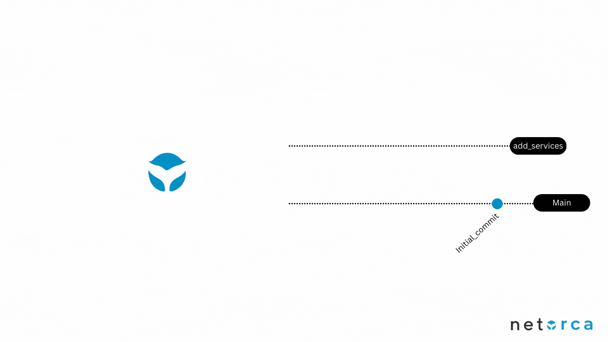
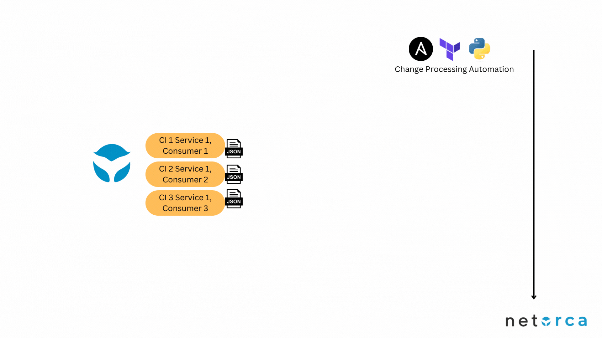

# Full lifecycle self-service

In `Level-6` we evolve the automation framework into a scalable customer centric solution that supports full lifecycle self-service. 
To do this we utilise the **NetOrca** product provided by **NetAutomate** which provides an orchestration layer to abstract how a service is offered vs how it is requested by the customer. 

The end result of this is that our diagram is changed to the following:




# Table of Contexts

- [Use case workflow](#use-case-workflow)
- [Code Explanation](#code-explanation)
  - [Pipeline](#pipeline)
- [Demo](#demo)

## Benefits

Level-5 started to reach the limits of best-practice just using Git repos and terraform. It works well for a small scale deployment but at large scales it starts to have a number of issues. All of these issues are potentially addressed by adding an orchestration layer in the middle. 

Level-6 does this using NetOrca. 

The benefits to this are:
- **Customer Input**
  - Customer CI/CD process is simplified, it no longer needs to build the AS3
  - Delete and Modify are directly supported from the customer repository
  - Synching between an upstream and downstream repo is no longer required.
  - Complexity is abstracted, no need for customers to ever see AS3, even in a CI/CD process. 
- **Customer Feedback**
  - NetOrca shows the state of a customer request and when it is deployed onto the infrastructure, this way customers can see exactly when their request is deployed, and also what it's deployed state is at any one time (without having to look in and understand another repos terraform state file).
- **Service Ownership**
  - the BigIP team is now able to change the customer input requirements as their service evolves. A change to the service schema requires no changes in CI/CD pipelines or the process and could be applied to new services only, not effecting existing customers until they wanted to modify
  - Downstream repository is optional. Service Owners can now use the NetOrca database as the source of truth, removing the need for a infrastructure repository
  - State is tracked, Terraform is no longer necessary as the state changes can be tracked in the orchestrator. More simplified tools can be used to push changes and these can be used by less experienced engineers (or a NOC)


## General Workflow explanation

1. Service Owners need to define the Service they offer in JSON Schema (including validation). This is then published via a standard Git Repo and CI/CD process
   1. This process allows for future modifications of the schema throughout the lifecycle
2. Consumer teams have multiple options to request instances of this Service either by:
   1. Git repo and standardised CI/CD process
   2. NetOrca GUI input, which can later be moved to Git
   3. Any other service calling the NetOrca declarative service api. 
3. The CI/CD process on the consumer side is standardised and is very lightweight. 
4. NetOrca manages changes from multiple customer inputs, it raises Change Instances either CREATE, DELETE, or MODIFY
5. Any method can be used to deploy to F5 devices, we will include Ansible and Terraform deployment examples in this project. 


### Customer Workflow explanation

The customer (NetOrca Consumer) workflow is as follows:
- Create a declaration for the Service in their Git Repo
- Create a merge request, the CI/CD process will show any validation errors that require correction
- Merge that to main, the CI/CD process will push it to NetOrca
- On NetOrca view the change instances, when they are marked complete the config has been deployed to the infrastructure



### Service Owners - Schema Updates

The Service Owner workflow for updating Schemas is:

1. Make required schema changes within GitRepo
2. Create merge request to main, build will run validation check and report any issues
3. Merge, build will submit updated schema to NetOrca



### Service Owners - General Processing of Changes

Customer requested changes will be published on NetOrca in the form of Change Instances for the particular service.

There are two stages which need to be processed, one is an optional second level validation stage. In this stage the Service Owner can take the Consumers Change Instance tickets and validate them as required before approving them. This validation could be an auotmated check of an external or related resource, or it could be a simple approval.

#### Validation Stage



The process for automating this validation would be performed by any automation script such as ansible or a third party tool. The basic operation is as follows:

1. Get APPROVED 
The general processing of these changes will be the following:

1. Service Owner team gets the APPROVED changes from the NetOrca API
2. Service Owner playbook extracts the Consumer ServiceItem declarations and converts them into AS3.
3. The AS3 is submitted to the BigIP devices
4. If successfully submitted the ChangeInstance is marked as COMPLETED.

This general process works for CREATE, DELETE and MODIFICATION of ServiceItems and can be completed imperatively or declaratively. 


```yaml
---
# Filename app01.yml

application1:
  services:
    LOAD_BALANCER:
      - name: load_balancer1
        partition: prod
        location: dmz
        comments: This is a new web server for testing
        type: http
        virtual_server:
          ip: 10.1.10.152
          port: 80
        members:
        - ip: 10.1.20.21
          port: 30880

```


## Demo
> [!IMPORTANT]
> `UDF` environment is not available for this level.


### f5devcentral NetOrca demo instance details:
- **url**       ->        https://f5devcentral.demo.netorca.io/
- **username**  ->        f5devcentral
- **password**  ->        netorcaf5

### Look into the repositories

We have created 3 repositories that you can play around with
- **Customer A**                    -> https://gitlab.com/netorca_public/bigip-automation/level-6/customer-a
- **Customer B**                    -> doesn't have a configuration repository - this team's requests are submitted via the NetOrca Submission Builder (GUI)

- **(Service Owner) BIGIP Team**    -> https://gitlab.com/netorca_public/bigip-automation/level-6/service-owner-bigip-team
- **BIGIP Team Automation**         -> https://gitlab.com/netorca_public/bigip-automation/bigip-team-automation (NOTE: this can be put in the ServiceOwner repo)

Description of the repositories:
- **Customer A** repository holds NetOrca YAML files that will contain the application configuration.
- **(Service Owner) BIGIP Team** repository holds JsonSchema definition of Services offered by BIGIP Team.
- **BIGIP Team Automation** repository contains automation used to create/modify/delete services in the BIG-IP.


###NetOrca GUI:
1. Context switching:
  - NetOrca gives you the ability to be a Service Owner and a Customer.
  - You can offer your services as a Service Owner and in the same time request other services from the same NetOrca instance.


2. Team switching:
  - NetOrca allows users to be a part of multiple teams and switch between them easily. 
  - This is helpful when you are working with multiple teams and need to view the state of a team's requests, or submit requests for them


Instructions for interacting with each stage of the demo is here:

- [Customer A - Requesting a Service Item via GIT](customer_a/README.md)
- [Customer B - Requesting a Service Item via the GUI](customer_b/README.md)
- [BigIP Team - Defining and declaring a Service onto NetOrca](bigip_team/README.md)
- [BigIP Team - Processing customer requested changes from NetOrca](bigip_team_processing/README.md)

---
