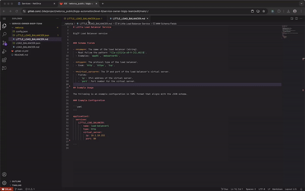

# Overview
Service Owners are responsible for creating and maintaining Service definitions that they offer via NetOrca.<br>
Services are defined in JsonSchema format which are then stored in GitLab repository.<br>
All changes to the Service definitions are done via GitLab repository and submitted to NetOrca via CICD pipeline.

## Service Owner flow

### Step 1. Create Service definition in JsonSchema format

```md
{
    "$id": "https://example.com/service.schema.json",
    "$schema": "https://json-schema.org/draft/2020-12/schema",
    "type": "object",
    "title": "LITTLE_LOAD_BALANCER",                                    #<---- `title` is unique identifier of the Service in NetOrca
    "metadata": {                                                       #<---- `metadata` is a place where Service Owner can put any information about the Service
      "monthly_cost": 100,                                              #<---- one of NetOrca features is Charging API
      "cost_per_change": 500
    },
    "properties": {
      "name": {                                                         #<---- `name` is the only required property in the Service definition
        "type": "string",
        "pattern": "^([a-z]{1}[a-z0-9-]{1,60})$",                       #<---- jsonschema offers powerful validation capabilities like enums, regex, lists, objects in objects etc
        "examples": [
          "app01",
          "webserver01"
        ]
      },
      "type": {
        "type": "string",
        "enum": ["http", "https", "tcp"],                               
        "examples": [
          "http",
          "https"
        ]
      },
      "virtual_server": {
        "type": "object",
        "required": ["ip", "port"],
        "properties": {
          "ip": {
            "type": "string",
            "format": "ipv4",
            "examples": [
              "10.1.10.152"
            ]
          },
          "port": {
            "type": "integer",
            "examples": [
              80,
              443
            ]
          }
        }
      }
    },
    "required": [
      "name",
      "type",
      "virtual_server",
    ],
    "description": "New load balancer on F5 BigIP"
  }
  
```

### Step 2. Create README.md file with explanation of the Service and example usage

```md
# Little Load Balancer Service

BigIP Load Balancer service


### Schema Fields

- **name**: The name of the load balancer (string).
  - Must follow the pattern `^([a-z]{1}[a-z0-9-]{1,60})$`.
  - Examples: `app01`, `webserver01`.

- **type**: The protocol type of the load balancer.
  - Enum: `http`, `https`, `tcp`.

- **virtual_server**: The IP and port of the load balancer’s virtual server.
  - Fields:
    - `ip`: IPv4 address of the virtual server.
    - `port`: Port number for the virtual server.

## Example Usage

The following is an example configuration in YAML format that aligns with the JSON schema.

### Example Configuration

```yaml
---

application1:
  services:
    LITTLE_LOAD_BALANCER:
      - name: load-balancer1
        type: http
        virtual_server:
          ip: 10.1.10.152
          port: 80
```


```
### Step 3. Create a Merge Request with the changes, merge to main branch

> - after merge to main branch, CICD pipeline will be triggered and new Service will be available in NetOrca
> - check the Service in NetOrca Service Catalog




### Step 4. Play around with Service settings in NetOrca GUI


### Step 5. Get familiar with ADVANCED FEATURES (versioning, service configs, allowed teams, dependant teams)
