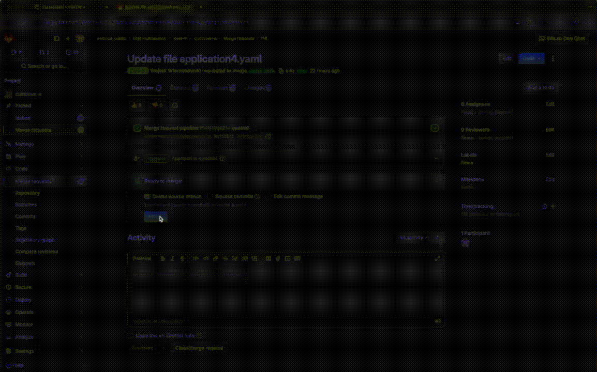
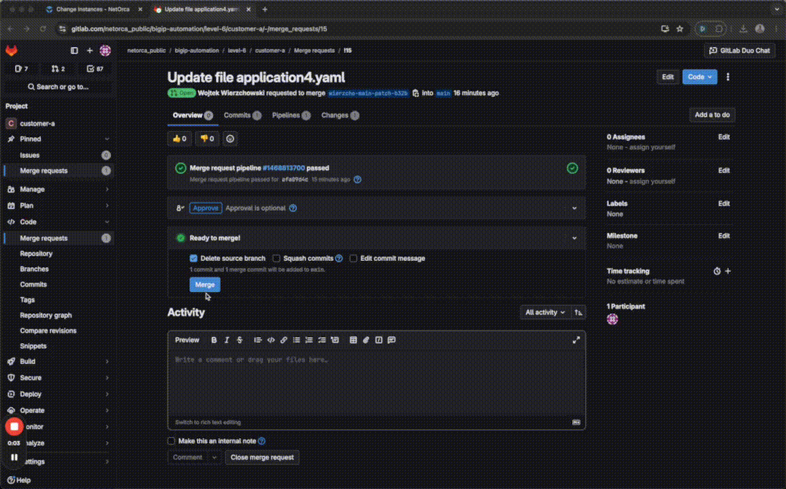
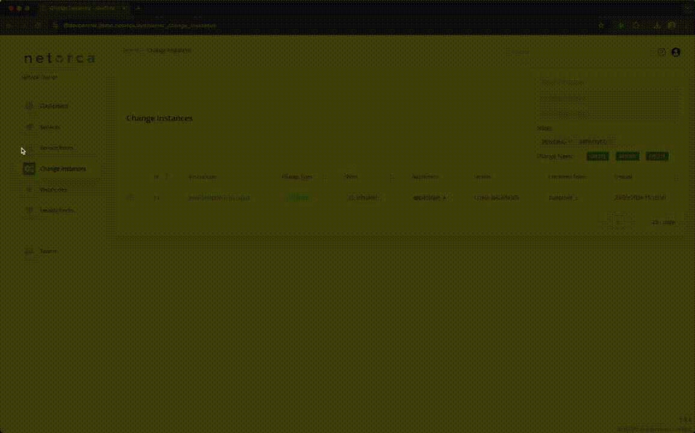

# Overview
Service Owner teams are responsible for creating and maintaing their Services in NetOrca. This is covered in [BIGIP_TEAM](../bigip_team/README.md). 
Another responsibility of Service Owners is to process requests submitted by customers. Service Owners need to establish a workflow for processing Change Instances that come in to their queue.

## Definitions
- **Service** is well-defined piece of infrastructure that Service Owner Team offers to the Customers. Service Owner team defines the Service in a form of JsonSchema and is responsible for further processing of the infrastructure implementation. Examples: Web Server, Load Balancer, Firewall, etc.
- **Service Item** is an instance of a Service that is requested by a Customer. It is described by a Service Item name and a set of parameters defined in the Service JsonSchema. Service Item stores an actual state of Customer request.
- **Change Instance** is a change that is applied to a Service Item by a Customer. Customer can generate CREATE, MODIFY or DELETE Change Instances. Change Instances are reviewed and APPROVED/REJECTED/COMPLETED by Service Owner. APPROVED Change instances are processed by Service Owner team and effectively implemented as pieces of infrastructure.

## Processing Change Instances
Change Instances are processed by Service Owner team according to the workflow defined by them. NetOrca workflow is implemented as a series of state transitions of Change Instances. 
Changes can be processed manually (via GUI) or programatically (via API). It's up to Service Owner how processing of the Change Instances will be implemented. We highly encourage using automation-first approach and implementing processing of the Change Instances with API. This streamlines the workflow and makes it more reliable and easier to manage.

## Change Instance state Lifecycle
Change Instance Lifecycle is as follows:
- **PENDING** - Change Instance is created and waits for approval/validation by Service Owner.
- **PENDING -> APPROVED** - Change Instance is approved by Service Owner
- **PENDING -> REJECTED** - Change Instance is rejected by Service Owner because of some validation/compliance issues.

 

- **APPROVED** - Change Instance is approved by Service Owner and is ready for deployment/implementation in the infrastructure.
- **APPROVED -> COMPLETED** - Change Instance is deployed into the infrastructure and completed.
- **APPROVED -> ERROR** - Change Instance is not deployed due to some error.

## Workflow scenarios

### Step 1. Customer submits a brand new Service Item

> This step is already covered in [CUSTOMER_A](../customer_a/README.md) and [CUSTOMER_B](../customer_b/README.md)

### Step 2. Service Owner reviews Change Instance generated by Customer request
> This step takes Change Instance state from PENDING to APPROVED, or PENDING to REJECTED.
> Depends on the Service configuration, newly created Change Instance can be automatically approved or requires manual approval.

#### Step 2.1. Change Instance is preapproved
> When Change Instance is automatically approved it appears in NetOrca with statue "APPROVED" - at this stage it's ready for deployment.

#### Step 2.2. Change Instance requires manual approval
> When Change Instance requires manual approval it appears in NetOrca with status "PENDING" - it needs to be validated by Service Owner either via GUI or API.
> This gives additional control over requests that come into NetOrca. For example, Load Balancer Service requires IP addresses to be added to the declaration. Service Owner may want to check in external systems (like Infoblox or whatever is used in the organisation) if given IP address is available for use before APPROVING Change Instance.

### Step 2.2.1. Change Instance APPROVED via GUI

### Step 2.2.2. Change Instance APPROVED via API (programmatically)
TODO: gif here

### Step 3. Change Instance is deployed
> This step takes Change Instance state from APPROVED to COMPLETED.
> This is the most important step in the workflow as it effectively implements the Customer request.
> Process is usually automated with some orchestration tool like Ansible or Terraform and is solely managed by Service Owner team.
> Goal of this step is to:
> * fetch all Change Instances that are in APPROVED state for Service X
> * do some custom logic (if needed) like filter by environment or other parameters
> * extract declarations from Service Items linked to Change Instances
> * translate declarations into format that is supported by the infrastructure (for example BIG-IP AS3 declaration), add custom logic (if needed) like splitting into multiple partitions, adding custom objects, requesting objects in external systems etc.
> * deploy it onto the F5 infrastructure and/or other external systems if needed
> * mark Change Instances as COMPLETED if automation run is successful

#### Step 3.1. Change Instance is automatically deployed with Ansible Playbook

TODO: gif here

#### Step 3.2. Change Instance is automatically deployed with Terraform

TODO: gif here
