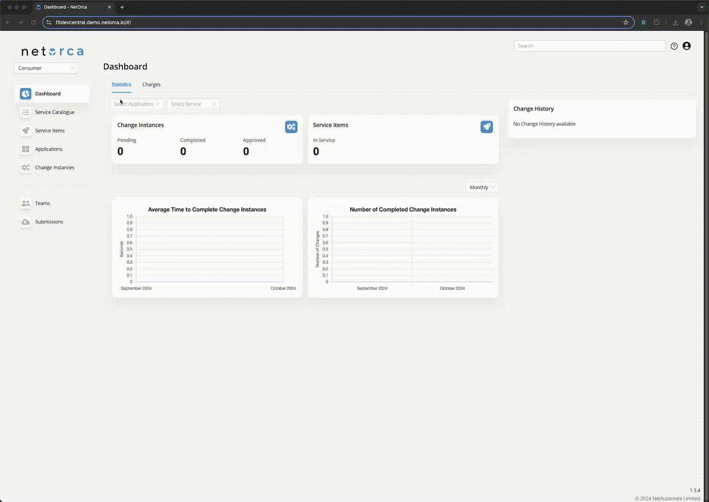

# Overview

This guide provides a step-by-step overview of how to interact with NetOrca as a Customer in declarative/GitOps mode. 
This setup requires property setup GitLab repository with CICD pipeline and NetOrca configuration. 
GitOps approach is preferred as it allows for a more transparent and collaborative process.

Benefits of using GitOps mode:
- Merge Request process allows team to review changes before they are submitted
- All changes are versioned and visible in the GitLab repository
- Changes are easily auditable and trackable
- Repository serves as a single source of truth for all changes of a Team

Repository used in this example:
https://gitlab.com/netorca_public/bigip-automation/level-6/customer-a 

## Declarative / GitOps workflow
### Step 1. Go to NetOrca Service Catalog, find a Service you want to request and get the example YAML definition.

> Service Catalogue is the place where you can find details for all the Services offered via NetOrca.
> There are 3 tabs in the Service Catalogue:
> - **README** - information about the Service provided by the Service Owner
> - **Schema** - detailed JsonSchema definition of the Service - you can look up the details for each property
> - **Example** - generator of yaml/json code for the Service

### Step 2. Create service definition either by copying README example or using Submission Builder.

#### Step 2.1 Using README example

#### Step 2.2 Using Submission Builder

### Step 3; request it via your Customer A GitLab repository.

> - In this step you will create a new branch, modify the example, create a merge request and watch the pipeline to pass.
> - Your requests will be sent to NetOrca and validated against Service definition.

#### Step 3.1 Validation successful

> - Once the pipeline is green, that meants the request is valid and can be merged to main branch.

#### Step 3.2. Validation failed

> - In case of validation failure, you will see the error message in the pipeline logs. Most likely you didn't add required properties or made a typo.
> - You will need to fix the request and update merge request.

### Step 4. Merge MR (Merge Request) into the main branch and watch the CI/CD pipeline to run.

> - After MR is merged, the Submission job will be triggered and changes will be pushed to NetOrca.
> - NetOrca will determine the type of change (CREATE/DELETE/MODIFY) and create a corresponding Change Instance.

#### Step 4.1. CREATE Change Instance

#### Step 4.2. MODIFY Change Instance

#### Step 4.3. DELETE Change Instance

### Step 5. Check status of your requests live in NetOrca GUI.

> - At this stage, the responsibility for processing the customer request shifts to the Service Owner.
> - By default, the Change Instance will be in a PENDING state, awaiting approval from the Service Owner.
> - The APPROVED status indicates that the Service Owner has validated and approved the request.
> - The REJECTED status means that the Service Owner has rejected the request due to an issue.
> - The COMPLETED status indicates that the request has been successfully deployed on the BIG-IP system.

