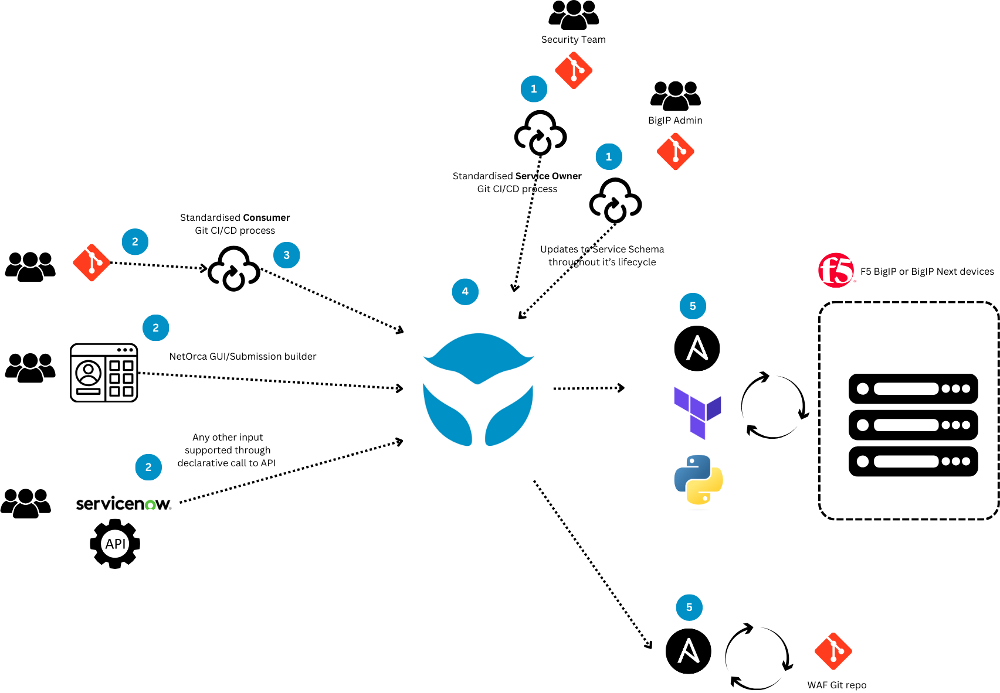

# Full lifecycle self-service with multiple Service Owners

In `level-7` we will scale the demo up again by introducing mutliple Service Owners. This will show how a decouple customer self-service solution like this can be scaled to accomodate for any type of Service offered by any number of teams throughout the organisation. All while still maintaining a single customer repository for self-service and a well defined standardised CI/CD process that can scale as required. 

Our diagram now looks like the following:

